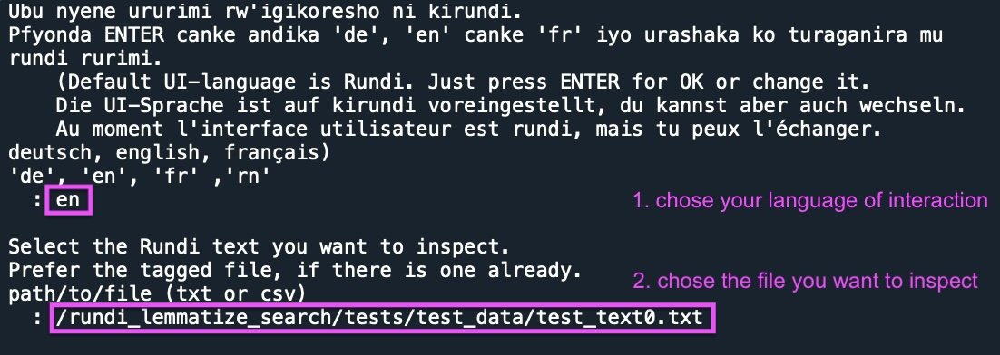
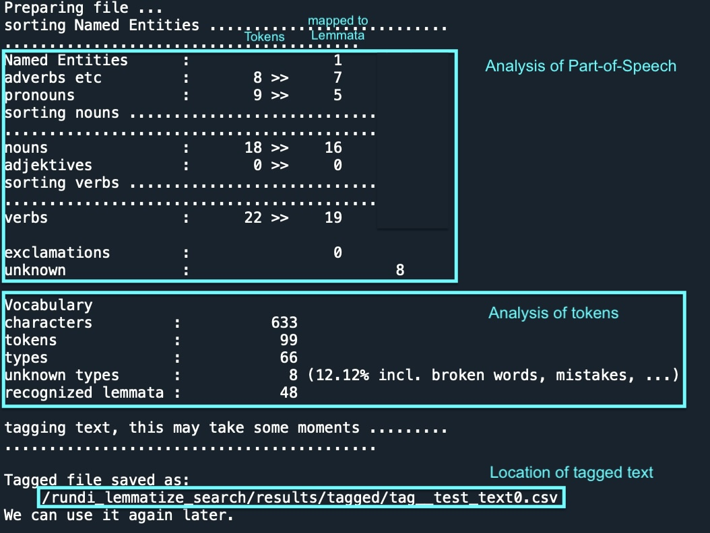
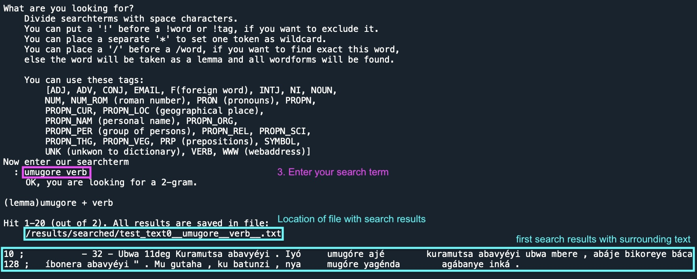

# KIRUNDI lemmatize and search

## Name
KIRUNDI-nlp

## Description
KIRUNDI-nlp is a tool to analyse Rundi texts by lemmatizing.  
That way NLP statistic tasks are more efficient, because it reduces tokens not only to types but to lemmata. This is important because in Bantu languages the verbform contains in itself also subject, up to three objects, time, negation, perfectiv and other features ... combined with 16 classes of nouns there is a huge number of forms possible.  
KIRUNDI-nlp takes a text and returns its tokens tagged with lemma and PoS. 
With this it's also possible:
- to search N-grams by combinations of token, lemma or Part-of-Speech
- view the frequency distribution of types
- view the frequency distribution of lemmata
- recieve a version of the text with lemmata replacing the tokens  
The tag will be "UNK" if it doesn't find an appropriate lemma or Named-Entity in the underlying database.

## Dependencies
nltk, unidecode  
It's written in Python3    

## Usage
There is no GUI right now.  
Run lemmatize_search/kir_start_input_console.py  
Than choose your preferred language for using the App: Rundi, English or German.  
And enter the path/to/txt.file you want to analyse. 
  
You'll get some statistics and a csv-file with the tagged text.  
  
Than enter your text-search-query.  
  

## Support
deki.kazinduzi(at)gmail.com  

## Roadmap
Make a GUI or host it on a website.  
For a website an extended version of the dictionary could be used.  

## Contributing
There are different ways to contribute:  
1.  
This project needs a user-interface.  
contact deki.kazinduzi(at)gmail.com  
2.  
You could check your tagged text for "UNK" and propose to identify these words as Named-entity or as a new entry for the dictionary. Please provide in this case also grammar features (Singular and Plural of nouns, respectively Infinitiv and Perfektiv of verbs, in best case also pronounciation, for Named-entites the special tag or a short description).  
Mail your proposals to deki.kazinduzi(at)gmail.com  
3.  
You could check your tagged text for wrong tags and report them.  

## Authors and acknowledgment 
code:  
Doreen Nixdorf  

data:  
This app uses the Rundi words of the  
"Dictionary: Kirundi-English, English-Kirundi" by Elizabeth Cox (1969),  
digitalised and reviewed by Martin Philipps (2020),  
structured as database by Sarah Wingert (2020),   
(extended by Evrard Ngabire, Doreen Nixdorf 2023)

## License
This work is licensed under CC BY-NC-SA 4.0
