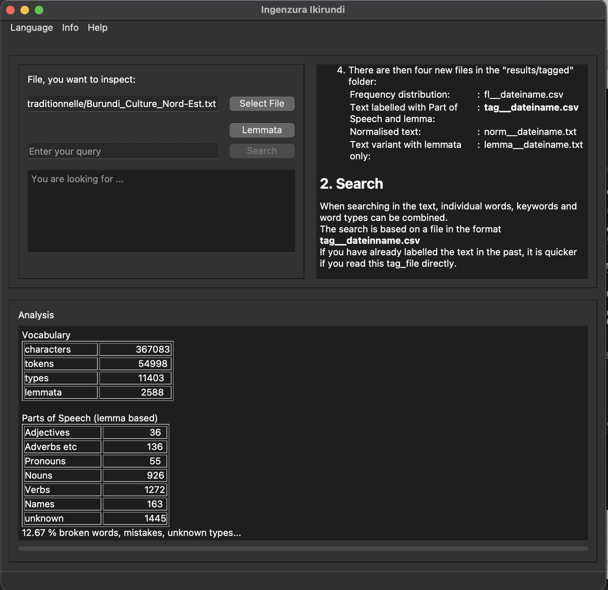
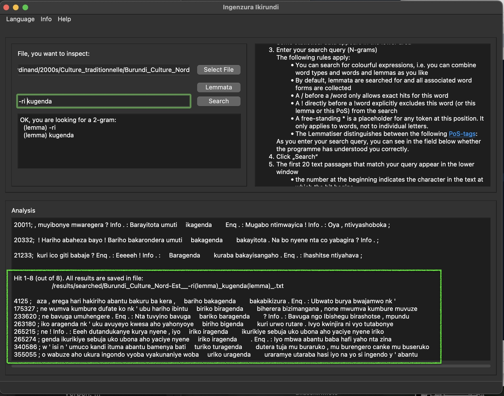

# KIRUNDI lemmatize and search

## Name
KIRUNDI-nlp

## Description
KIRUNDI-nlp is a tool to analyse Rundi texts by lemmatizing.  
That way NLP statistic tasks are more efficient, because it reduces tokens not only to types but to lemmata. This is important because in Bantu languages the verbform contains in itself also subject, up to three objects, time, negation, perfectiv and other features ... combined with 16 classes of nouns there is a huge number of forms possible.  
KIRUNDI-nlp takes a text and returns its tokens tagged with lemma and PoS. 
With this it's also possible:
- to search N-grams by combinations of token, lemma or Part-of-Speech
- view the frequency distribution of types
- view the frequency distribution of lemmata
- recieve a version of the text with lemmata replacing the tokens  
The tag will be "UNK" if it doesn't find an appropriate lemma or Named-Entity in the underlying database.

## Dependencies
nltk, unidecode, pyqt  
It's written in Python3    

## Usage 
Run lemmatize_search/ingenzura_main.py  
Choose your preferred language for using the App: Rundi, English or German and start again.   

  

Follow the descriptions in the window in the right corner.  
After selecting the file you want to analyse, press "Lemmata" and you'll get some statistics and a csv-file with the tagged text, named "tag__filename.csv".  
In the same folder you'll find also the frequency distribution of lemmata of the text (named "fl__filename.csv") and a file with the normalised text (named "norm__filename.txt") and a version where all tokens are replaced by their lemma(this file is named lemma__filename.txt).   

  

Then enter your search-query.  

  

If there are results you'll find a list of maximum 20 results down in the window, but all results are stored in a txt-file.  
The name of the results-file ends with your search query. In our example it's:  
"/results/searched/Burundi_Culture_Nord-Est_-ri(lemma)_kugenda(lemma)_.txt".  
Each result includes a number followed by your search term with surrounding text (previous and following 50 characters).  
The number indicates the position where your search term starts in the normalised text.  

Attention:  
Before tagging the program looks up if there is already a tagged file ("tag__filename.csv") in the folder "/results/tagged".  
Also before a search, it will look up in the folder "/results/searched" if this search was done already.  
That means, if you changed the text in your file delete the tag-file and the search-files of this text, because it won't refresh them. Or give your text-file an unused name.  

## Support
deki.kazinduzi(at)gmail.com  

## Roadmap
Let's host it on a website.  
The extended version of the dictionary could be used there.  

## Contributing
There are different ways to contribute:  
1.  
You could check your tagged text for "UNK" and propose to identify these words as Named-entity or as a new entry for the dictionary. Please provide in this case also grammar features (singular and plural of nouns, respectively infinitive and perfective of verbs, in best case also pronounciation, for Named-entites the special tag or a short description).  
Mail your proposals to deki.kazinduzi(at)gmail.com  
2.  
You could check your tagged text for wrong tags and report them.  
3.  
You can propose improvements for the user experience.  

## Authors and acknowledgment 
Code:  
Doreen Nixdorf  

Data:  
This app uses the Rundi words of the  
"Dictionary: Kirundi-English, English-Kirundi" by Elizabeth Cox (1969),  
digitalised and reviewed by Martin Philipps (Bujumbura Christian University, 2020),  
structured as database by Sarah Wingert (Bujumbura Christian University, 2020),   
(extended by Evrard Ngabire (Deutschzentrum at University of Burundi), Doreen Nixdorf 2023)  

## License
This work is licensed under CC BY-NC-SA 4.0
